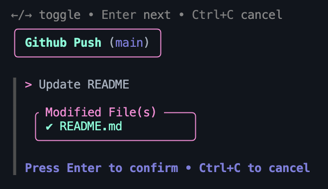

# GitCharm

**GitCharm** is a simple and interactive command-line tool for managing Git commits and pushes with fun. It provides a visually appealing interface for handling Git operations, making the process smoother and more enjoyable.

<center></center>

### Features
- Displays the current branch and modified files.

- Allows you to write a commit message interactively.

- Provides visual feedback for successful operations.

- Handles errors gracefully with user-friendly messages.

### Installation
1. Clone the repository:
```
git clone https://github.com/novationlabs/gitcharm.git
```

2. Move the script to `/usr/local/bin` to make it a globally available command:
```
sudo cp gitcharm /usr/local/bin
```

3. Ensure the script is executable:
```
chmod +x /usr/local/bin/gitcharm
```

### Usage
Simply run:
```
gitcharm
```

### Requirements

- Python 3.10 or higher.

- `prompt_toolkit` library (install via pip):
```
pip install prompt_toolkit
```

### Workflow

1. Navigate to your Git repository.

2. Run `gitcharm`.

3. Follow the on-screen prompts to:
    - Enter a commit message.

    - Review modified files.

    - Confirm and push changes.

---
Enjoy a charming Git experience with **GitCharm** ✨
